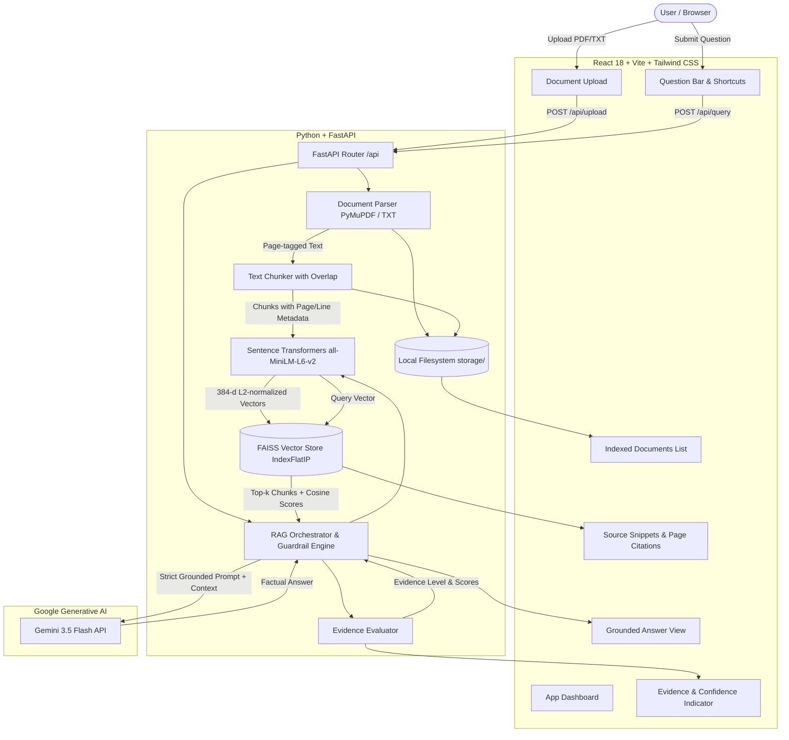

# Smart Document Assistant

An intelligent, grounded Document Question & Answering (RAG) assistant designed to ingest multi-page PDF and TXT documents, extract content with precise page and section tracking, index text using dense vector embeddings, and deliver factual answers powered by **Gemini 3.5 Flash-Lite**—complete with an **Answer Confidence / Evidence Indicator**.

---

## 1. Problem Understanding

Organizations and users deal with lengthy PDF reports, policy manuals, and technical documentations. Traditional keyword search often fails to synthesize answers across multiple passages, while standard conversational LLMs frequently **hallucinate** facts, fabricate dates or page citations, and cannot be audited for factual correctness.

**The Smart Document Assistant solves this by:**
1. **Accurate Document Parsing**: Preserving exact page boundaries for PDFs (via PyMuPDF) and line segments for TXT files.
2. **Context-Preserving Chunking**: Breaking documents into overlapping semantically coherent passages, each carrying immutable citation metadata (`doc_id`, `filename`, `page_number`, `chunk_id`).
3. **Local Vector Search**: Indexing dense embeddings via FAISS (`IndexFlatIP`) with cosine similarity.
4. **Answer Confidence / Evidence Indicator**: Evaluating semantic similarity scores, density of retrieved evidence, supporting documents, and cited pages.
5. **Strict Grounding & Hallucination Elimination**: Enforcing a strict retrieval threshold and system prompts so the LLM explicitly states when information is not present rather than inventing answers.

---

## 2. Architecture & Data Flow

### Architecture Diagram



### Data Flow Explanation

1. **Ingestion & Parsing**:
   - The user selects or drags PDF or TXT files in the React interface.
   - Files are sent to FastAPI (`POST /api/upload`).
   - PyMuPDF (`fitz`) parses PDFs page-by-page, extracting clean text while recording exact 1-indexed page numbers. TXT files are parsed preserving line counts.
2. **Chunking & Tagging**:
   - `TextChunker` splits pages into chunks (default 600 chars with 120 char overlap), prioritizing natural paragraph and sentence endings.
   - Each chunk is permanently tagged with `doc_id`, `filename`, `file_type`, `page_number`, and `chunk_id`.
3. **Embedding & Vector Storage**:
   - Chunks are encoded into 384-dimensional dense vectors using `sentence-transformers/all-MiniLM-L6-v2`.
   - Embeddings are L2-normalized, allowing the FAISS `IndexFlatIP` (inner product) to compute exact cosine similarity scores.
   - Vector indices and metadata are persisted locally to `backend/storage/faiss_index.bin`, `chunks.json`, and `documents.json`.
4. **Retrieval & Evidence Evaluation**:
   - A user question is embedded using the same Sentence Transformer model.
   - FAISS retrieves the top-$k$ nearest chunks.
   - `RAGService` evaluates the similarity distribution, calculating:
     - `max_similarity` (peak alignment)
     - `avg_similarity` (coverage depth)
     - Aggregate Evidence Score (0–100%)
     - Evidence Level: **High**, **Medium**, or **Low**
5. **Anti-Hallucination Guardrail & Generation**:
   - **Low-Evidence Intercept**: If the peak cosine similarity is below `0.28`, the system rejects the question immediately without risking LLM hallucinations: *"I cannot answer this question based on the provided documents as the necessary information was not found."*
   - **Grounded Prompting**: If evidence exists, the excerpts are presented to **Gemini 3.5 Flash** with temperature `0.1` and explicit instructions to rely solely on the context and cite document names and pages.
6. **Presentation**:
   - The answer is rendered in the UI alongside the **Confidence Badge**, aggregate evidence meter, page citations, and expandable source snippets.

---

## 3. Technology Choices

| Layer | Technology | Rationale |
| :--- | :--- | :--- |
| **Frontend** | React 18, Vite, Tailwind CSS | Lightning-fast HMR, clean component tree, modern responsive styling, and minimal bundle footprint. |
| **Icons** | Lucide React | Modern, consistent iconography for file formats, statuses, and evidence badges. |
| **Backend** | Python 3.10+, FastAPI, Uvicorn | High-performance asynchronous REST API with automatic OpenAPI documentation and native Pydantic validation. |
| **PDF Parsing** | PyMuPDF (`fitz`) | Extremely fast C-backed PDF engine capable of extracting text cleanly with 100% accurate page-level attribution. |
| **Embeddings** | Sentence Transformers (`all-MiniLM-L6-v2`) | Lightweight (80MB), runs efficiently on standard CPUs without GPU dependencies, and produces high-quality 384-d semantic representations. |
| **Vector Store** | FAISS (`faiss-cpu` IndexFlatIP) | Industry standard for nearest-neighbor vector search; provides sub-millisecond retrieval with direct cosine similarity on normalized vectors. |
| **LLM** | Gemini 3.5 Flash (`google-genai`) | State-of-the-art fast reasoning model with large context capacity, low latency, and high instruction adherence for factual RAG. |
| **Storage** | Local Filesystem + JSON | Simple, transparent, inspectable, and zero external database setup overhead. |

---

## 4. Setup & Environment Variables

### Prerequisites
- **Python**: 3.10 or higher
- **Node.js**: v18 or higher (v22 tested)
- **Gemini API Key**: From [Google AI Studio](https://aistudio.google.com/)

### Environment Variables
In `backend/`, copy `.env.example` to `.env`:

```bash
cd backend
cp .env.example .env
```

Edit `backend/.env`:
```ini
# Required: Google Gemini API Key
GEMINI_API_KEY=your_gemini_api_key_here

# Optional Configurations
HOST=127.0.0.1
PORT=8000
EMBEDDING_MODEL=sentence-transformers/all-MiniLM-L6-v2
GEMINI_MODEL=gemini-3.5-flash
TOP_K=5
CONFIDENCE_HIGH_THRESHOLD=0.60
CONFIDENCE_MEDIUM_THRESHOLD=0.42
UNANSWERABLE_THRESHOLD=0.28
```

> **Security Note:** Never commit `.env` or any file containing API keys to version control. The `.gitignore` file already excludes `.env`.

---

## 5. How to Run Frontend & Backend

### Running the Backend

```bash
# 1. Navigate to backend
cd backend

# 2. Activate virtual environment
# On Windows (PowerShell):
.\venv\Scripts\Activate.ps1
# On Linux/macOS:
source venv/bin/activate

# 3. Start the FastAPI server
uvicorn app.main:app --reload --host 127.0.0.1 --port 8000
```
The backend will be available at `http://127.0.0.1:8000`. Interactive API documentation is available at `http://127.0.0.1:8000/docs`.

### Running the Frontend

```bash
# 1. In a new terminal, navigate to frontend
cd frontend

# 2. Start the Vite development server
npm run dev
```
Open `http://localhost:5173` in your browser.

---

## 6. How Hallucination is Reduced

Hallucination in RAG typically occurs due to: (a) retrieving irrelevant passages and forcing the LLM to guess, (b) high model temperature encouraging speculative creativity, or (c) lack of clear boundaries for unanswerable questions.

We reduce hallucination through a multi-tiered defense:

1. **Retrieval Threshold Filter**:
   Before invoking the LLM, the system checks the top cosine similarity score. If the maximum similarity is below `UNANSWERABLE_THRESHOLD` (e.g. `0.28`), the system returns an unanswerable status directly without querying the LLM.
2. **Deterministic Sampling**:
   The model is invoked with `temperature=0.1` and `max_output_tokens=1024`, focusing generation purely on the most probable factual tokens.
3. **Strict Negative Constraint System Instruction**:
   The system instruction mandates:
   > *"Answer the question using ONLY the provided excerpts. If the excerpts do not contain the answer, you MUST say exactly: 'I cannot answer this question based on the provided documents as the necessary information was not found.' Never speculate, extrapolate, or use outside knowledge."*
4. **Granular Citations**:
   Every chunk provided to the prompt is prefaced with `[Source X: filename.pdf (Page Y)]`, and the model is instructed to cite these markers for every factual assertion.
5. **Explicit Evidence Indicator & Disclaimer**:
   The UI highlights confidence based on actual retrieval similarity scores with an explicit disclaimer:
   > *"Confidence is estimated strictly from semantic retrieval similarity scores and context coverage. It reflects evidence relevance, not a guaranteed probabilistic truth."*

---

## 7. AI Tools Used

- **PyMuPDF**: For fast, high-fidelity PDF text and structure extraction.
- **Sentence Transformers (`all-MiniLM-L6-v2`)**: Pretrained bi-encoder language model mapping sentences and paragraphs to a 384-dimensional dense semantic space.
- **FAISS**: Facebook AI Similarity Search for exact vector retrieval.
- **Gemini 3.5 Flash**: Google's frontier multimodal / reasoning LLM optimized for high speed, low latency, and precise grounded synthesis.

---

## 8. Known Limitations & Future Work

- **OCR for Scanned PDFs**: Currently, documents must contain digital text streams. Scanned images of text would require an OCR layer (such as Tesseract or PyMuPDF's OCR feature).
- **Tabular Data Complexities**: Complex multi-column tables or nested structures can occasionally be split across chunk boundaries; future iterations could incorporate layout-aware chunking (e.g., Markdown table conversion).
- **Single-Node In-Memory Vector Store**: FAISS `IndexFlatIP` runs locally in memory. For enterprise deployments exceeding millions of documents, a distributed vector database (e.g., Milvus, Qdrant, or Pinecone) can be substituted seamlessly.
